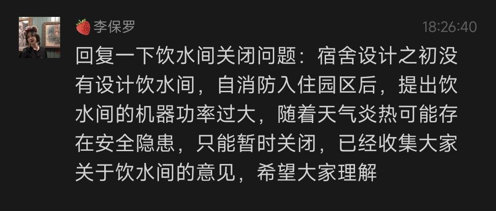

**重要提示**： 由于部分国家机关网站过于拉跨，甚至没有加密措施，在进行举报时请尽量使用数据网络，不要使用园区 WiFi，以免被光速橄榄

## 目录

- [目录](#目录)
- [通过 12345 举报 （推荐）](#通过-12345-举报-推荐)
- [通过 12315 举报](#通过-12315-举报)
- [纪委监察举报](#纪委监察举报)
- [案例](#案例)
  - [园区以夏季耗电大为由，停止宿舍楼饮水机开放](#园区以夏季耗电大为由停止宿舍楼饮水机开放)
  - [某校辅导员开店遭园区恶意举报](#某校辅导员开店遭园区恶意举报)

## 通过 12345 举报 （推荐）

可以直接拨打 12345 举报，也可以从[海南省12345政务服务平台](https://12345.hainan.gov.cn/hnwsbsdt/hnwebsite/pages/default/index)进行举报。

## 通过 12315 举报

12315 适用于消费者维权，如果你发现园区内有商家存在欺诈行为，可以通过 12315 进行举报。

[12315 举报入口](https://www.12315.cn/)

1. 打开网站，点击我要举报
2. 搜索 `海南陵水黎安` 会搜索到 3 个单位
   推荐选择第二个，主管园区管理服务，如果是建筑质量等问题，可以选择第一个
3. 注册账号，填写举报内容，提交即可

## 纪委监察举报

直达链接：[海南省纪委监委举报](http://hainan.12388.gov.cn/lingshuixian/)

纪委监察适用于较为严重性质问题的举报，例如恐吓学生，贪污腐败等问题。

## 案例

### 园区以夏季耗电大为由，停止宿舍楼饮水机开放

参考文案：

园区罔顾学生生活，以夏季耗电大为由，停止宿舍楼饮水机开放，强制推广付费饮水机，严重影响学生生活。园区内各个高校收取高额学费，却无法保障学生基本生活权益，我在此请求有关部门尽快调查，还学生一个良好的学习生活环境。

### 某校辅导员开店遭园区恶意举报

此行为**性质恶劣**，推荐通过**纪委监察**进行举报。

参考文案：

高校园区是学生与老师工作学习的场所，然而近期发生的一起事件让我感到震惊。某校辅导员在园区内开设小店，为学生提供便利，却遭到园区恶意举报，园区内工作人员对学校辅导员进行恶意举报，甚至对其进行人身攻击和恐吓。我在此请求有关部门尽快调查其中利益关系以及是否存在黑恶势力，给学生和老师一个合理的交代。

以下内容摘自某辅导员发布的 pdf 文件：

> 一、10月16日：接到恶意匿名举报
> 2023 年10月16日，我正在教师公寓管理的微信群里（群里只有教师+园区配套工作人员）和其他老师一起投诉教师公寓的必经车道多处被人恶意洒落钉子，并且已经有不少老师的车胎被扎到的问题。但是微信上并没有工作人员就这件事情给老师们一个满意的回复。
> 突然微信群上有一个自称园区工作人员的人，在群上@了Lulu的账号，并且说有事找我，让我通过她的好友申请。这个时机就很妙。
> 因为她并没有表明身份并且@的是我的微信工作号，我比较狐疑，但了解到是有学生家长通过12345热线匿名举报我后，我感到很奇怪：我在自己的本职工作中并不涉及到接触学生或者家长的工作，并且在过去从事大学内工作的时候也没发生过类似的事情。才通过了她的好友申请。
> 她说有学生家长因为孩子吃东西吃坏了举报我，要求我出示证件，因为我在私下从来没有接到任何微信好友们就安全方面跟我的沟通和建议，如果有极少其他的反馈，也是全部都执行了得到了双方同意的解决方式。
> 所以我在微信中，积极跟这位自称园区工作人员的人进行沟通（并未告诉我属于什么部门以及姓名），但随着她的描述和问询，我却发现这是一起捏造的恶意投诉事件（聊天记录原文见附件一）。
> 聊天记录中错漏百出，主要有以下疑点：
> 1. 学生出问题了，我认为出于孩子的安全考虑。一个正常的家长应该第一时间与我联系，并要求赔偿的是医药费而不是要求我出示各类证照；
> 2. 对方无法出具任何所谓孩子在我这里购买商品的记录以及就医证明，更不用说就医原因是和我直接相关的证据。
> 3. 对方能够拿出来的证据只是我在教师公寓群里和Teastardust这个微信群上发送的照片，并没有进一步的记录。然而教师群里面应该只有园区工作的老师和其他配套的工作人员。为何学生家长能拿到我们教师群的微信聊天记录？
> 在与这位工作人员沟通完毕后，基于想要好好解决事情的想法。我找到了转发给她这些所谓“投诉人”出示照片的微信聊天记录的园区工作人员，并给他打去了电话。
> 第一次他称他在会议中不方便接听我的电话，拒绝接听。隔了几个小时后我再打过去，他再次拒绝接听我的电话。然后微信文字告诉我，他并不知道这些事（附件二）。当然微信上的聊天记录是他转发给那位第一次找我的Eno的工作人员的，所以我很肯定，他不会对此毫不知情。
> 除此以外，我也第二天拨打了12345解释了我的情况，第一次接听电话的回复是我不需要任何证照，然而因为我有些问题没明白，下午继续打过去，转接到另一个单位，又告诉我是需要证照的。我不知道该听信谁的话，中间多次拨打12345企图解决这个问题。并且也在进一步完善各类手续以防万一。直到近两日，我才得到陵水县市场监管单位的友善回复，告诉我还是应该办理2种证照，并且他们在电话中也热情的指导了我，并告诉我这些流程也都是为了便民非常简单。因此我也很感谢他们。

> 二、10月18日：Eno被退款，迅速屏蔽朋友圈和退出Tea Stardust 群聊
> 在这件事情发生后，我意识到可能这个举报事件并非如此简单，也很确定那个恶意举报的人或者其他人还在Tea stardust的群里。因此我多留心了了一点。我的uu们很多都是园区的学生很少有老师或者其他的人。所以想要简单区分还不算难。
> 因此有一天我看到Eno出现在我的List的时候，出于对上次事情的警惕。也担心有人拿到东西之后诬陷我，我就没有接受，并全款退回。我联想到“投诉人”出示的证据里面有Tea stardust的群聊截图，因此我马上回到群上检查是否我的群成员里面有Eno，发现她果然是我的群成员。于是我立马屏蔽了我的朋友圈并将她拉黑之后，再回来看我的群成员，她就不在群里了。
> 我怀疑是自己看错了，于是马上一次翻阅群上的加群记录，发现她果然是10.10那天入群的（附件三），而她给我显示的12345匿名投诉工单就是发生在10.12，.
> 在今天之前，甚至是恶意投诉发生之前，她跟我之间没有任何联系。她突然向我付款，退款后又马上屏蔽了她的朋友圈（第一次加她的时候，她的朋友圈是开放的），这多少让我觉得有些诡异了。
> 我以为她也意识到她的企图被我发现之后，而我忍了下来，她和后面的人也会见好就收。但我发现这样的恶意并没有就此停下

> 三、10月25日：带上市监所的工作人员大闹我的工作单位
> 就在今天，我们的领导办公室来了一群不速之客，没有任何预约，没有任何提前的沟通。连我的领导都是一脸懵。
> 领导把我叫过去的时候，狭小的办公室内外乌压压站了接近10个人，男女都有，都带着不同单位的工作牌。我也不知道他们的来意。
> 带橙色工作牌子的人员率先发难，说收到12345的热线学生家长匿名举报（和上次的举报一模一样），来找我问话。我心里有了谱，便问他们分别是哪些单位的人，大概了解到，有一站式的工作人员若干，市监所的工作人员若干和联合学院的一男一女站在办公室外静观其变。
> 整个过程非常乱糟糟，重点说来就是。市监所的工作人员非常nice，听说我没有营业了之后就说没有再说什么，不打算继续追究。但是打头的一站式工作人员还要与我缠斗，要我给个说法。我也不知道他们找我要什么说法。尤其是我早已知道她们本就是满怀恶意。我就让她既然说有人投诉我，那就拿证据出来。她拿不出证据，但还是一直扭住我。市监所的一名较为年长的男子，似乎是他们的领导，就从沙发上起身直接说可以走了，准备带着他们的团队撤出去。
> 门外观望的联合学院的人一听就急了，为首的人高马大，满脸痘痘的一名男子就冲进来说，马上查园区的监控，看我什么时候制作了，什么时候配送了，还指使市监所的人查出来最近是谁拨打了查询办理证照电话，电话是否能和我个人匹配上。
> “这不就有证据了！“”他得意洋洋地说。
> 我听后大为震惊，作为一名普通的的公民，若是在这个园区的生活足迹，联合学院的人可以侵犯我的公民权利，说看监控就看监控，说想抓住你在干嘛就干嘛。
> 作为一名询问如何才能拥有自己小店，才向城市12345热线打去咨询电话的市民，在没有任何违法犯罪的情况下，还要被人窃取电话内容。
> 这位为首的男子，连同他所在的单位一旦真的做了这件事情，已经构成了违法犯罪。除此以外，作为联合学院的工作人员他们竟然能如此没有法律意识，以及如此认为这个大学校园是一个他们横行霸道的法外之地。真是让我大开眼界，也深感害怕。
> 我在成都长大，求学旅游在海外也见识了不少，但这个男子的猖狂确实让我不由得胆寒。
> 市监委的工作人员立马说，人家打电话来咨询是别人的事情，我们不会提供给你们的，他们的信息是受到保护的。听到这里，我心里有了底气。市监所的工作人员已经走出了办公室门外，但联合学院和一站式的工作人员还是想要拦住他们。
> 我的领导就说，那等你们有了证据再来找我们吧。
> 才让联合学院和一站式的工作人员无奈的从办公室里面退了出去。
> 综上，为了避免给我的单位和各位维护我的同事带去不必要的困扰。Tea Stardust 的故事就暂时告一段落了，希望以后还有机会再见。以前加过我微信的uu们，还是可以继续和我保持联系:)

